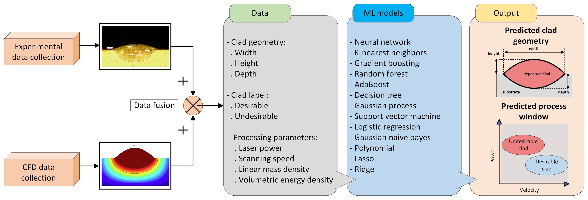

# CladNet-ML-for-AM

[A hybrid machine learning framework for clad characteristics prediction in metal additive manufacturing](https://arxiv.org/abs/2307.01872)

## Introduction

In this repository, we propose a generalizable ML framework for the prediction of clad geometrical features and optimal process window in Metal Additive Manufacturing. You can check out our [paper](https://arxiv.org/abs/2307.01872) for more details.

<p align="center">
    
</p>

## Setup and Requirements

This repository has been tested on the following environemt:

```
python == 3.10.11
gradio == 3.23.0
scikit-learn == 1.2.2
pandas == 1.5.3
numpy == 1.24.3
matplotlib == 3.7.1
scipy == 1.9.3
```
Clone the repository in your local machine, and activate your conda environement:

```bash
git clone https://github.com/sinatayebati/CladNet-ML-for-AM.git
cd CladNet-ML-for-AM
conda activate env.cladnet
```

Install the requirements:

```bash
pip install -r requirements.txt
```

## Cite

if you find our work useful in your research, please consider citing:

```
@article{tayebati2023hybrid,
  title={A hybrid machine learning framework for clad characteristics prediction in metal additive manufacturing},
  author={Tayebati, Sina and Cho, Kyu Taek},
  journal={arXiv preprint arXiv:2307.01872},
  year={2023}
}
```

## Authors

[Sina Tayebati](https://scholar.google.com/citations?user=GjfKPkUAAAAJ&hl=en&oi=ao), [Kyu Taek Cho](https://scholar.google.com/citations?user=uayzyQQAAAAJ&hl=en)